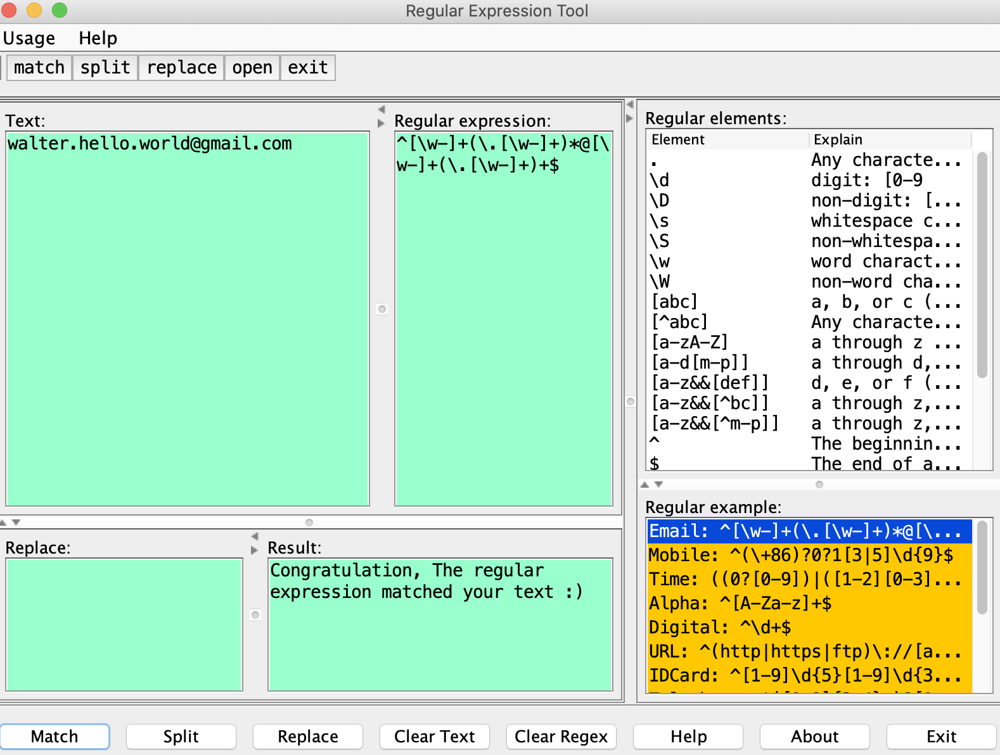

# Introduction

It is a small tool to write and validate regluar expression that I wrote long long time ago.

It's useful to me and someone may like it, so I extract it from old code repo and build it to a standalone tool.



Please star it if you like it.

Please raise git issue if you want new functions, or you can submit a PR to enhance it by yourself.

Thanks, Walter

# How to use it?

1. clone this repo

2. cd regex_helper

3. compile and package, JDK is required

```sh
mvn clean package
```

4. run it

```sh
# windows
./target/regex_helper.exe
# macos or linux
./target/regex_helper
```